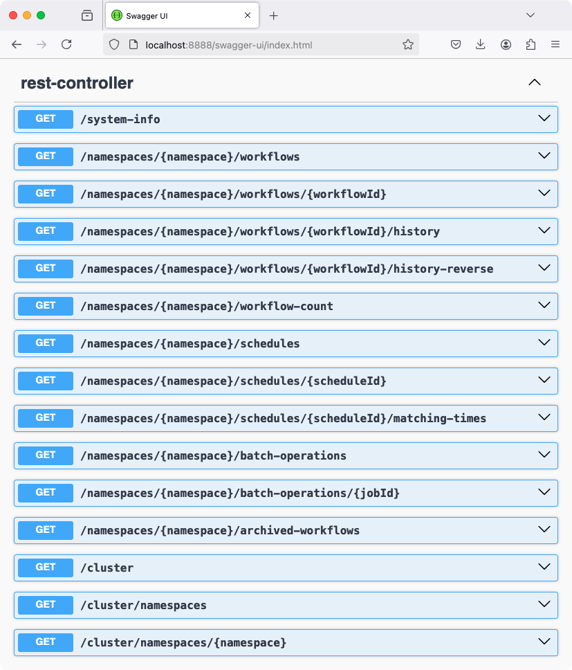

# Temporal REST Proxy

Swagger UI @ http://localhost:8888/swagger-ui/index.html

Based on https://github.com/temporalio/api/blob/master/openapi/openapiv3.yaml

## Launch

    ./mvnw clean spring-boot:run

## Preview

